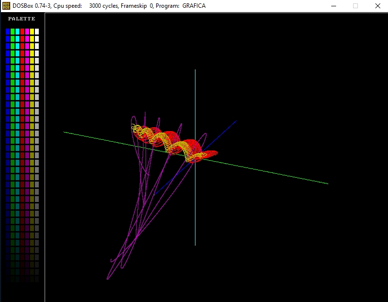
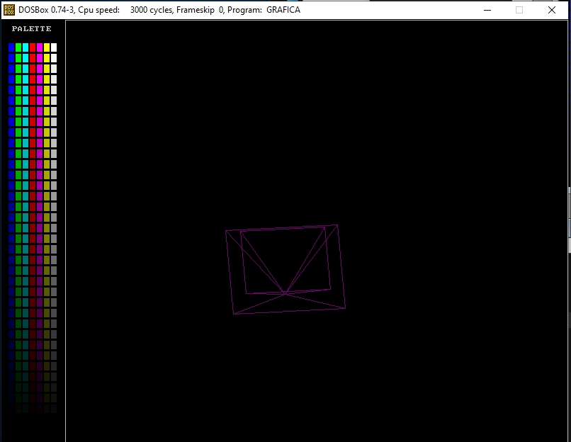
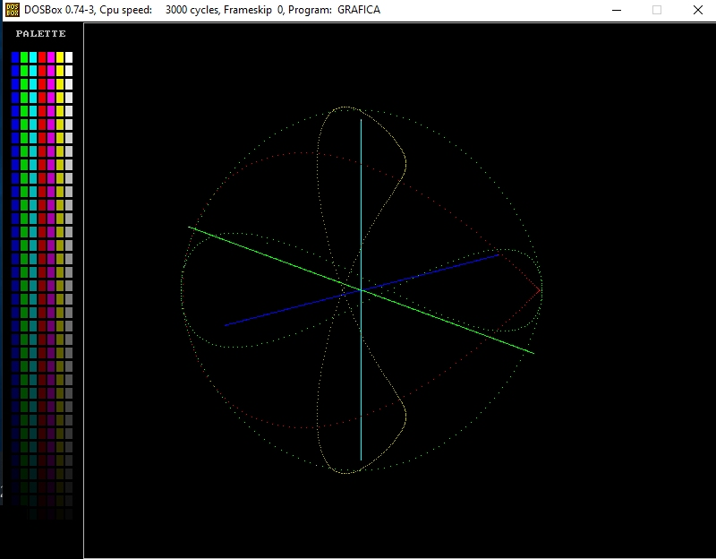
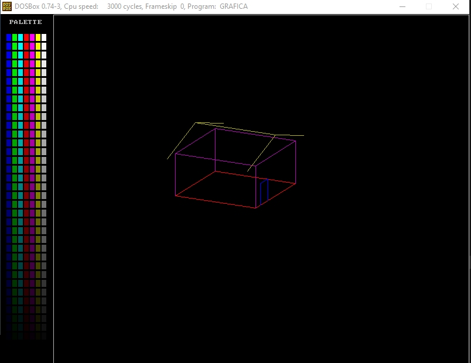
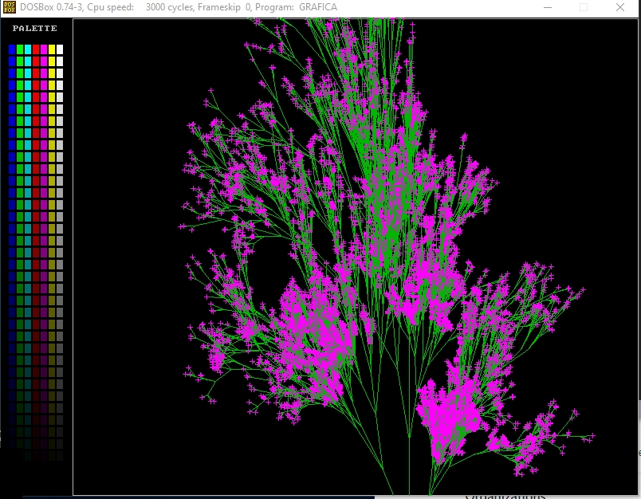

# CGRotines

Computer Graphic 2D/3D primitives routines. 
This is a simple implementation for grafical primitis (viewport, observer, cam, etc...) .

<table width:100%>
  <tr>
    <td></td>
    <td></td>
    <td></td>
  </tr>
  <tr>
    <td></td>
    <td></td>
    <td></td>
  </tr>
</table>

